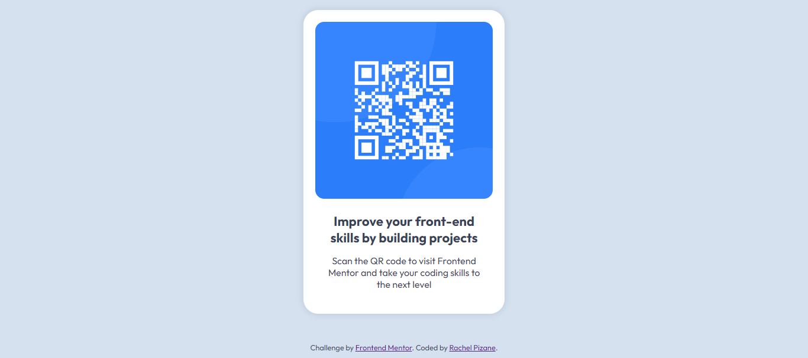

# QR code component solution | Frontend Mentor 
This is a solution to the [QR code component challenge on Frontend Mentor](https://www.frontendmentor.io/challenges/qr-code-component-iux_sIO_H).

## Table of contents

- [Overview](#overview)
  - [Screenshot](#screenshot)
  - [Links](#links)
- [My process](#my-process)
  - [Built with](#built-with)
  - [What I learned](#what-i-learned)
  
## Overview

### Screenshot

### Links

- Solution URL: [GitHub Page - QR Code](https://rachelpizane.github.io/FM01-QR-Code/)

## My process

### Built with

- Semantic HTML5 markup
- CSS custom properties

### What I learned

By doing this challenge I was able to practice how to center the elements and better understand the proportions.
